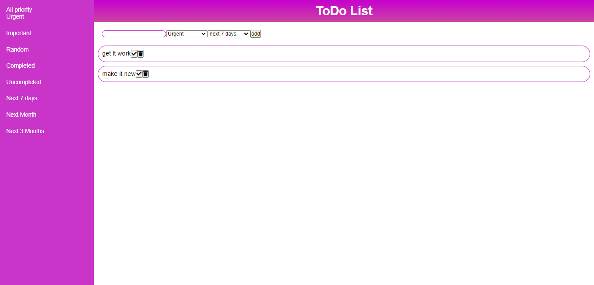

[](https://github.com/prettier/prettier)
[](https://github.com/mercy-wumi/todolist/blob/master/LICENSE)

</p>
<p align="center">
 <h3 align="center">Reactjs_Todolist</h3>
  <p align="center">
    <br />
    <a href="https://github.com/mercy-wumi/todolist.git"><strong>View Demo »</strong></a>
    <br />
    <br />
    <a href="https://github.com/mercy-wumi/todolist.git/issues">Report Bug</a>
    ·
    <a href="https://github.com/mercy-wumi/todolist.git/issues">Request Feature</a>
  </p>
</p>

## Table of Contents

- [About the Project](#about-the-project)
  - [Built With](#built-with)
- [Getting Started](#getting-started)
  - [Prerequisites](#prerequisites)
  - [Installation](#installation)
- [Contributing](#contributing)
- [License](#license)


## About Reactjs_Todolist



A reactjs todo application built to perform basic CRUD operation.

### Built With

List of major frameworks use to build DevCoach App.

- [Reactjs](https://reactjs.org/)


## Getting Started

To get a local copy up and running follow these simple steps.

### Prerequisites

- npm

```sh
npm install npm@latest -g
```

### Installation

1. Clone the repo

```sh
git clone https://github.com/mercy-wumi/todolist.git
```

2. Install NPM packages

```sh
npm install
```

3. Start the project in development

```sh
npm start
```

## Contributing

To contribute to this project follow the steps below. Any contributions you make are **greatly appreciated**.

1. Fork the Project
2. Create your Feature Branch (`git checkout -b feature/AmazingFeature`)
3. Commit your Changes (`git commit -m 'Add some AmazingFeature'`)
4. Push to the Branch (`git push origin feature/AmazingFeature`)
5. Open a Pull Request

## License

Distributed under the MIT License. See `LICENSE` for more information.

